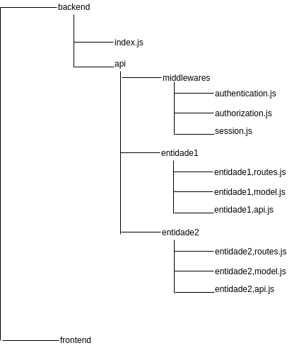

# calendario-escolar

Projeto desenvolvido na disciplina de Desenvolvimento de Aplicaçes Distribuídas.

## Estrutura do Projeto
O Projeto é divido em dois diretórios principais (ambos diretórios utilizam a linguagem JavaScript,): backend e frontend.

O backend foi desenvolvido utilizando tecnologias como Express.js (para criação do servidor) e Mongoose (modelagem dos dados e consultas ao banco de dados). Dentro da pasta backend o arquivo index.js é responsável por carregar as dependências, conectar com o banco de dados e inicializar o servidor. 
Ainda nesse diretório a pasta api contém a um diretório para cada entidade do sistema e um diretório de middlewares. Cada diretório de entidade contém 3 arquivos: entidade.model.js, entidade.routes.js e entidade.api.js.

O arquivo .model contém a definição do Schema de cada entidade no banco de dados, enquanto o arquivo .routes define as rotas para as requisições da api, por último o arquivo .api são as funções da API de cada entidade.
A  pasta de middlewares possui 3 arquivos para controle de sessão do usuário e controle de acesso a API.
